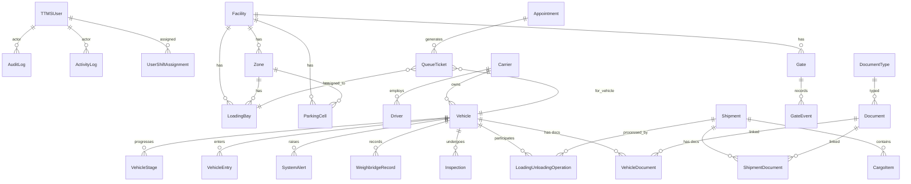

# TTMS Database Schema (Production-Ready)

This document defines a comprehensive database schema for the TTMS backend (Django + PostgreSQL). It extends the current models with a normalized, scalable design that supports multi-facility operations, security, and future integrations (IoT/real-time).

- Database: PostgreSQL (recommended)
- ORM: Django (models shown as examples)
- Key conventions:
  - All tables include audit fields: `created_at`, `updated_at`, `created_by_id`, `updated_by_id`.
  - Critical tables include soft-delete: `is_deleted`, `deleted_at`.
  - Use `on_delete` behaviors for referential integrity.
  - Use Django `choices` (enums) for status/typed fields.
  - Prefer `JSONB` for flexible metadata fields where appropriate.


## 1) Current Core Models (as-is, with suggested enhancements)

- KPIMetrics
- Vehicle
- VehicleStage
- LoadingGate (see LoadingBay below)
- ParkingCell
- VehicleEntry
- SystemAlert
- TurnaroundTimeSparkline
- Auth: TTMSUser (email login, roles)

Suggested enhancements (non-breaking unless noted):
- Vehicle: add `owner_company`, `driver_id` (FK), `vehicle_type`, `status`, `facility_id`, soft-delete.
- VehicleStage: add `performed_by_id` (FK TTMSUser), `notes`, soft-delete.
- LoadingGate: superseded by generalized Facility/Zone/LoadingBay below. Keep for backward compatibility or migrate to `LoadingBay`.
- ParkingCell: add `facility_id`, `zone_id` (FK), `is_deleted`.
- VehicleEntry: add `gate_id` (FK), `purpose` (loading/unloading/other), `entry_operator_id`, `exit_operator_id`, `gate_exit_time`, soft-delete.
- SystemAlert: add `facility_id`, `zone_id`, `extra -> JSONB`.


## 2) Enhanced Domain Model: New Entities

- Facilities and Layout
  - Facility
  - Zone (within facility)
  - Gate (multiple entry/exit gates)
  - LoadingBay (dock)

- Human Resources / Shifts
  - Shift
  - Personnel (optionally mapped to TTMSUser)
  - UserShiftAssignment

- Drivers and Carriers
  - Carrier (Transporter)
  - Driver
  - DriverDocument

- Scheduling & Queueing
  - Appointment
  - QueueTicket

- Gate Ops & Weighbridge
  - GateEvent
  - WeighbridgeRecord

- Inspections
  - InspectionChecklist
  - InspectionItem
  - Inspection (instance per vehicle/shipment)
  - InspectionResult

- Cargo/Shipment & Operations
  - Shipment
  - CargoItem
  - LoadingUnloadingOperation

- Document Verification
  - DocumentType
  - Document
  - VehicleDocument (junction)
  - ShipmentDocument (junction)

- Audit & Activity
  - AuditLog
  - ActivityLog


## 3) ER Diagram (Mermaid)




## 4) Table Definitions and Relationships

Note: `*_id` implies FK. All timestamps are timezone-aware.

### 4.1 Facility & Layout

- Facility
  - id (PK)
  - code (unique), name, address, timezone
  - is_active (bool)
  - created_at, updated_at
  - created_by_id, updated_by_id

- Zone
  - id (PK)
  - facility_id (FK Facility, on_delete=CASCADE)
  - code (unique within facility), name, type (parking, loading, staging)
  - created_at, updated_at, created_by_id, updated_by_id, is_deleted, deleted_at

- Gate
  - id (PK)
  - facility_id (FK Facility, CASCADE)
  - name (unique within facility), direction (entry/exit/both)
  - is_active (bool)
  - created_at, updated_at, created_by_id, updated_by_id

- LoadingBay
  - id (PK)
  - facility_id (FK Facility, CASCADE)
  - zone_id (FK Zone, PROTECT)
  - name (unique within zone)
  - status (available/occupied/maintenance)
  - created_at, updated_at, created_by_id, updated_by_id

- ParkingCell (extends existing)
  - id (PK)
  - facility_id (FK Facility, CASCADE)
  - zone_id (FK Zone, PROTECT)
  - area (keep for compatibility), label (unique within zone)
  - status (available/occupied/reserved)
  - vehicle_id (FK Vehicle, SET_NULL)
  - created_at, updated_at, created_by_id, updated_by_id, is_deleted, deleted_at

### 4.2 Drivers & Carriers

- Carrier
  - id (PK)
  - name (unique), code, contact_info JSONB
  - is_active
  - created_at, updated_at, created_by_id, updated_by_id

- Driver
  - id (PK)
  - carrier_id (FK Carrier, SET_NULL)
  - first_name, last_name, phone, license_no (unique), license_valid_till (date)
  - status (active/suspended/blacklisted)
  - created_at, updated_at, created_by_id, updated_by_id, is_deleted, deleted_at

- DriverDocument
  - id (PK)
  - driver_id (FK Driver, CASCADE)
  - document_type_id (FK DocumentType, PROTECT)
  - document_id (FK Document, CASCADE)
  - is_primary (bool)
  - created_at, updated_at, created_by_id, updated_by_id

### 4.3 Vehicles (extend existing)

- Vehicle (existing + new fields)
  - id (PK)
  - reg_no (unique)
  - rfid_no (unique, nullable)
  - vehicle_type (tractor, trailer, rigid, etc.)
  - owner_company (FK Carrier, SET_NULL)
  - driver_id (FK Driver, SET_NULL)
  - facility_id (FK Facility, PROTECT)
  - tare_weight (int)
  - weight_after_loading (int)
  - status (in_yard, departed, blocked, maintenance)
  - progress (0-100), turnaround_time (mins), timestamp
  - created_at, updated_at, created_by_id, updated_by_id, is_deleted, deleted_at

- VehicleStage (existing + new fields)
  - id (PK)
  - vehicle_id (FK Vehicle, CASCADE)
  - stage (gateEntry, tareWeighing, loading, postLoadingWeighing, gateExit)
  - state (completed/active/pending)
  - wait_time, standard_time, started_at, finished_at, time_taken
  - performed_by_id (FK TTMSUser, SET_NULL)
  - notes (text), created_at, updated_at, created_by_id, updated_by_id
  - unique (vehicle_id, stage)

- VehicleEntry (existing + new fields)
  - id (PK)
  - vehicle_id (FK Vehicle, CASCADE)
  - facility_id (FK Facility, PROTECT)
  - gate_id (FK Gate, PROTECT)
  - purpose (loading/unloading/other)
  - area (string) [legacy]
  - position (string) [legacy]
  - loading_gate (string) [legacy]
  - gate_entry_time (datetime)
  - gate_exit_time (datetime, null)
  - entry_operator_id, exit_operator_id (FK TTMSUser, SET_NULL)
  - created_at, updated_at, created_by_id, updated_by_id, is_deleted, deleted_at

### 4.4 Scheduling & Queue

- Appointment
  - id (PK)
  - facility_id (FK Facility, PROTECT)
  - vehicle_id (FK Vehicle, PROTECT)
  - shipment_id (FK Shipment, SET_NULL)
  - scheduled_start, scheduled_end
  - priority (low/normal/high/urgent)
  - status (scheduled/checked_in/no_show/cancelled/completed)
  - notes, metadata JSONB
  - created_at, updated_at, created_by_id, updated_by_id, is_deleted, deleted_at

- QueueTicket
  - id (PK)
  - appointment_id (FK Appointment, CASCADE)
  - vehicle_id (FK Vehicle, PROTECT)
  - bay_id (FK LoadingBay, SET_NULL)
  - number (string), position (int)
  - status (waiting/called/servicing/abandoned/completed)
  - called_at, serviced_at, completed_at, cancelled_at
  - created_at, updated_at, created_by_id, updated_by_id

### 4.5 Gate & Weighbridge

- GateEvent
  - id (PK)
  - facility_id (FK Facility, PROTECT)
  - gate_id (FK Gate, PROTECT)
  - vehicle_id (FK Vehicle, PROTECT)
  - direction (entry/exit)
  - event_time
  - operator_id (FK TTMSUser, SET_NULL)
  - source (manual/rfid/ocr/anpr)
  - created_at, updated_at, created_by_id, updated_by_id

- WeighbridgeRecord
  - id (PK)
  - vehicle_id (FK Vehicle, PROTECT)
  - facility_id (FK Facility, PROTECT)
  - weigh_type (tare/gross/net)
  - weight_kg (int)
  - source (wb1, wb2, manual)
  - captured_at (datetime)
  - operator_id (FK TTMSUser, SET_NULL)
  - photo_url, extra JSONB
  - created_at, updated_at, created_by_id, updated_by_id

### 4.6 Inspections

- InspectionChecklist
  - id (PK)
  - name (unique), version, active (bool)
  - scope (pre_gate, pre_load, post_load)
  - created_at, updated_at, created_by_id, updated_by_id

- InspectionItem
  - id (PK)
  - checklist_id (FK InspectionChecklist, CASCADE)
  - code, description, datatype (bool, decimal, text, select)
  - required (bool), min_val, max_val, options JSONB
  - created_at, updated_at, created_by_id, updated_by_id

- Inspection
  - id (PK)
  - checklist_id (FK InspectionChecklist, PROTECT)
  - vehicle_id (FK Vehicle, PROTECT)
  - shipment_id (FK Shipment, SET_NULL)
  - status (pending/passed/failed)
  - started_at, finished_at
  - inspector_id (FK TTMSUser, SET_NULL)
  - created_at, updated_at, created_by_id, updated_by_id

- InspectionResult
  - id (PK)
  - inspection_id (FK Inspection, CASCADE)
  - item_id (FK InspectionItem, PROTECT)
  - value_text, value_bool, value_decimal, value_select
  - remarks
  - created_at, updated_at, created_by_id, updated_by_id

### 4.7 Cargo/Shipments & Operations

- Shipment
  - id (PK)
  - facility_id (FK Facility, PROTECT)
  - reference_no (unique), customer_name, destination, incoterm
  - status (planned/ready/loading/loaded/hold/cancelled/closed)
  - scheduled_load_date, actual_load_start, actual_load_end
  - created_at, updated_at, created_by_id, updated_by_id, is_deleted, deleted_at

- CargoItem
  - id (PK)
  - shipment_id (FK Shipment, CASCADE)
  - sku, description
  - quantity (decimal), uom
  - weight_kg (decimal), volume_cbm (decimal)
  - created_at, updated_at, created_by_id, updated_by_id

- LoadingUnloadingOperation
  - id (PK)
  - vehicle_id (FK Vehicle, PROTECT)
  - shipment_id (FK Shipment, PROTECT)
  - bay_id (FK LoadingBay, PROTECT)
  - operation_type (loading/unloading)
  - status (scheduled/in_progress/paused/completed/cancelled)
  - assigned_supervisor_id (FK TTMSUser, SET_NULL)
  - planned_start, planned_end, actual_start, actual_end
  - metrics JSONB (e.g., pallets_count, hose_used, pump_rate)
  - created_at, updated_at, created_by_id, updated_by_id

### 4.8 Document Verification

- DocumentType
  - id (PK)
  - code (unique), name, category (permit/insurance/customs/license/other)
  - validity_days (int), issuer, requirements JSONB
  - created_at, updated_at, created_by_id, updated_by_id

- Document
  - id (PK)
  - doc_type_id (FK DocumentType, PROTECT)
  - number, issue_date, expiry_date
  - status (valid/expired/revoked/pending)
  - file_url, checksum, metadata JSONB
  - created_at, updated_at, created_by_id, updated_by_id

- VehicleDocument
  - id (PK)
  - vehicle_id (FK Vehicle, CASCADE)
  - document_id (FK Document, CASCADE)
  - verified_by_id (FK TTMSUser, SET_NULL)
  - verified_at (datetime), status (pending/verified/rejected)
  - created_at, updated_at, created_by_id, updated_by_id

- ShipmentDocument
  - id (PK)
  - shipment_id (FK Shipment, CASCADE)
  - document_id (FK Document, CASCADE)
  - verified_by_id (FK TTMSUser, SET_NULL)
  - verified_at, status (pending/verified/rejected)
  - created_at, updated_at, created_by_id, updated_by_id

### 4.9 Audit & Activity

- AuditLog
  - id (PK)
  - actor_id (FK TTMSUser, SET_NULL)
  - action (create/update/delete/login/logout/approve/reject)
  - entity_type, entity_id
  - before JSONB, after JSONB
  - ip_address, user_agent
  - created_at

- ActivityLog
  - id (PK)
  - actor_id (FK TTMSUser, SET_NULL)
  - activity (free text/enum)
  - context JSONB
  - created_at


## 5) ON DELETE behaviors and Referential Integrity

- Facility → Zones/Gates/LoadingBays/ParkingCells: CASCADE (deleting a facility removes layout sub-entities).
- Vehicle → VehicleStage/WeighbridgeRecord/Inspections/Operations/VehicleDocument: CASCADE or PROTECT depending on retention policy. Recommended: PROTECT for legal audit data; cascade only where safe.
- Shipment → CargoItem/Operations/ShipmentDocument: CASCADE (items and junctions removed with shipment).
- Many FKs to TTMSUser use SET_NULL to preserve historical records if users are deactivated.


## 6) Indexing and Performance Strategy

- Common lookups
  - BTREE indexes on all FK columns: `facility_id`, `vehicle_id`, `shipment_id`, `gate_id`, `bay_id`, `zone_id`.
  - Composite indexes where temporal queries are common, e.g., `(facility_id, created_at)`, `(facility_id, status)`.
  - Unique constraints: `Facility.code`, `Vehicle.reg_no`, `Driver.license_no`, `DocumentType.code`, `Shipment.reference_no`.
- Time-series
  - Partial indexes for active records: `WHERE is_deleted=false`.
  - BRIN indexes for large append-only tables (GateEvent, WeighbridgeRecord) on `created_at`.
- JSONB
  - GIN indexes for JSONB fields frequently queried: `metrics`, `metadata`.


## 7) Django Model Examples (selected)

```python
# backend/ttms/domain/models_facility.py (example file split)
from django.db import models
from django.contrib.postgres.fields import ArrayField
from django.conf import settings

class Facility(models.Model):
    code = models.CharField(max_length=30, unique=True)
    name = models.CharField(max_length=120)
    address = models.TextField(blank=True)
    timezone = models.CharField(max_length=64, default="UTC")
    is_active = models.BooleanField(default=True)
    created_at = models.DateTimeField(auto_now_add=True)
    updated_at = models.DateTimeField(auto_now=True)
    created_by = models.ForeignKey(settings.AUTH_USER_MODEL, null=True, blank=True, on_delete=models.SET_NULL, related_name='+')
    updated_by = models.ForeignKey(settings.AUTH_USER_MODEL, null=True, blank=True, on_delete=models.SET_NULL, related_name='+')

class Zone(models.Model):
    TYPE_CHOICES = [("parking","Parking"),("loading","Loading"),("staging","Staging")]
    facility = models.ForeignKey('Facility', on_delete=models.CASCADE, related_name='zones')
    code = models.CharField(max_length=30)
    name = models.CharField(max_length=120)
    type = models.CharField(max_length=20, choices=TYPE_CHOICES)
    is_deleted = models.BooleanField(default=False)
    deleted_at = models.DateTimeField(null=True, blank=True)
    created_at = models.DateTimeField(auto_now_add=True)
    updated_at = models.DateTimeField(auto_now=True)
    created_by = models.ForeignKey(settings.AUTH_USER_MODEL, null=True, blank=True, on_delete=models.SET_NULL, related_name='+')
    updated_by = models.ForeignKey(settings.AUTH_USER_MODEL, null=True, blank=True, on_delete=models.SET_NULL, related_name='+')

    class Meta:
        unique_together = ("facility", "code")
        indexes = [models.Index(fields=["facility","code"]) ]

class Gate(models.Model):
    DIR_CHOICES = [("entry","Entry"),("exit","Exit"),("both","Both")]
    facility = models.ForeignKey('Facility', on_delete=models.CASCADE, related_name='gates')
    name = models.CharField(max_length=50)
    direction = models.CharField(max_length=10, choices=DIR_CHOICES, default="both")
    is_active = models.BooleanField(default=True)
    created_at = models.DateTimeField(auto_now_add=True)
    updated_at = models.DateTimeField(auto_now=True)
    created_by = models.ForeignKey(settings.AUTH_USER_MODEL, null=True, blank=True, on_delete=models.SET_NULL, related_name='+')
    updated_by = models.ForeignKey(settings.AUTH_USER_MODEL, null=True, blank=True, on_delete=models.SET_NULL, related_name='+')

    class Meta:
        unique_together = ("facility", "name")

class LoadingBay(models.Model):
    STATUS = [("available","Available"),("occupied","Occupied"),("maintenance","Maintenance")]
    facility = models.ForeignKey('Facility', on_delete=models.CASCADE, related_name='bays')
    zone = models.ForeignKey('Zone', on_delete=models.PROTECT, related_name='bays')
    name = models.CharField(max_length=50)
    status = models.CharField(max_length=20, choices=STATUS, default='available')
    created_at = models.DateTimeField(auto_now_add=True)
    updated_at = models.DateTimeField(auto_now=True)
    created_by = models.ForeignKey(settings.AUTH_USER_MODEL, null=True, blank=True, on_delete=models.SET_NULL, related_name='+')
    updated_by = models.ForeignKey(settings.AUTH_USER_MODEL, null=True, blank=True, on_delete=models.SET_NULL, related_name='+')

    class Meta:
        unique_together = ("zone", "name")
```

```python
# Drivers / Carriers (selected)
from django.contrib.postgres.fields import JSONField

class Carrier(models.Model):
    name = models.CharField(max_length=120, unique=True)
    code = models.CharField(max_length=30, blank=True)
    contact_info = models.JSONField(default=dict, blank=True)
    is_active = models.BooleanField(default=True)
    created_at = models.DateTimeField(auto_now_add=True)
    updated_at = models.DateTimeField(auto_now=True)

class Driver(models.Model):
    STATUS = [("active","Active"),("suspended","Suspended"),("blacklisted","Blacklisted")]
    carrier = models.ForeignKey('Carrier', null=True, blank=True, on_delete=models.SET_NULL, related_name='drivers')
    first_name = models.CharField(max_length=60)
    last_name = models.CharField(max_length=60, blank=True)
    phone = models.CharField(max_length=20)
    license_no = models.CharField(max_length=50, unique=True)
    license_valid_till = models.DateField(null=True, blank=True)
    status = models.CharField(max_length=20, choices=STATUS, default="active")
    is_deleted = models.BooleanField(default=False)
    deleted_at = models.DateTimeField(null=True, blank=True)
    created_at = models.DateTimeField(auto_now_add=True)
    updated_at = models.DateTimeField(auto_now=True)
```

```python
# Weighbridge and Gate Events (selected)
class GateEvent(models.Model):
    DIR = [("entry","Entry"),("exit","Exit")]
    facility = models.ForeignKey('Facility', on_delete=models.PROTECT)
    gate = models.ForeignKey('Gate', on_delete=models.PROTECT)
    vehicle = models.ForeignKey('ttms.Vehicle', on_delete=models.PROTECT)
    direction = models.CharField(max_length=10, choices=DIR)
    event_time = models.DateTimeField()
    operator = models.ForeignKey(settings.AUTH_USER_MODEL, null=True, blank=True, on_delete=models.SET_NULL)
    source = models.CharField(max_length=20, default='manual')
    created_at = models.DateTimeField(auto_now_add=True)

class WeighbridgeRecord(models.Model):
    TYPE = [("tare","Tare"),("gross","Gross"),("net","Net")]
    facility = models.ForeignKey('Facility', on_delete=models.PROTECT)
    vehicle = models.ForeignKey('ttms.Vehicle', on_delete=models.PROTECT)
    weigh_type = models.CharField(max_length=10, choices=TYPE)
    weight_kg = models.IntegerField()
    source = models.CharField(max_length=30, default='wb1')
    captured_at = models.DateTimeField()
    operator = models.ForeignKey(settings.AUTH_USER_MODEL, null=True, blank=True, on_delete=models.SET_NULL)
    photo_url = models.URLField(blank=True)
    extra = models.JSONField(default=dict, blank=True)
    created_at = models.DateTimeField(auto_now_add=True)
    updated_at = models.DateTimeField(auto_now=True)
```

```python
# Inspections (selected)
class InspectionChecklist(models.Model):
    SCOPE = [("pre_gate","Pre Gate"),("pre_load","Pre Load"),("post_load","Post Load")]
    name = models.CharField(max_length=120, unique=True)
    version = models.CharField(max_length=20, default='v1')
    scope = models.CharField(max_length=20, choices=SCOPE)
    active = models.BooleanField(default=True)
    created_at = models.DateTimeField(auto_now_add=True)
    updated_at = models.DateTimeField(auto_now=True)

class InspectionItem(models.Model):
    DATATYPES = [("bool","Boolean"),("decimal","Decimal"),("text","Text"),("select","Select")]
    checklist = models.ForeignKey('InspectionChecklist', on_delete=models.CASCADE, related_name='items')
    code = models.CharField(max_length=30)
    description = models.CharField(max_length=255)
    datatype = models.CharField(max_length=20, choices=DATATYPES)
    required = models.BooleanField(default=True)
    min_val = models.DecimalField(max_digits=10, decimal_places=2, null=True, blank=True)
    max_val = models.DecimalField(max_digits=10, decimal_places=2, null=True, blank=True)
    options = models.JSONField(default=list, blank=True)

class Inspection(models.Model):
    STATUS = [("pending","Pending"),("passed","Passed"),("failed","Failed")]
    checklist = models.ForeignKey('InspectionChecklist', on_delete=models.PROTECT)
    vehicle = models.ForeignKey('ttms.Vehicle', on_delete=models.PROTECT)
    shipment = models.ForeignKey('Shipment', null=True, blank=True, on_delete=models.SET_NULL)
    status = models.CharField(max_length=20, choices=STATUS, default='pending')
    started_at = models.DateTimeField(null=True, blank=True)
    finished_at = models.DateTimeField(null=True, blank=True)
    inspector = models.ForeignKey(settings.AUTH_USER_MODEL, null=True, blank=True, on_delete=models.SET_NULL)

class InspectionResult(models.Model):
    inspection = models.ForeignKey('Inspection', on_delete=models.CASCADE, related_name='results')
    item = models.ForeignKey('InspectionItem', on_delete=models.PROTECT)
    value_text = models.TextField(blank=True)
    value_bool = models.BooleanField(null=True, blank=True)
    value_decimal = models.DecimalField(max_digits=12, decimal_places=3, null=True, blank=True)
    value_select = models.CharField(max_length=60, blank=True)
    remarks = models.TextField(blank=True)
```

```python
# Appointments / Queue (selected)
class Appointment(models.Model):
    PRIORITY = [("low","Low"),("normal","Normal"),("high","High"),("urgent","Urgent")]
    STATUS = [("scheduled","Scheduled"),("checked_in","Checked In"),("no_show","No Show"),("cancelled","Cancelled"),("completed","Completed")]
    facility = models.ForeignKey('Facility', on_delete=models.PROTECT)
    vehicle = models.ForeignKey('ttms.Vehicle', on_delete=models.PROTECT)
    shipment = models.ForeignKey('Shipment', null=True, blank=True, on_delete=models.SET_NULL)
    scheduled_start = models.DateTimeField()
    scheduled_end = models.DateTimeField()
    priority = models.CharField(max_length=10, choices=PRIORITY, default='normal')
    status = models.CharField(max_length=20, choices=STATUS, default='scheduled')
    notes = models.TextField(blank=True)
    metadata = models.JSONField(default=dict, blank=True)
    is_deleted = models.BooleanField(default=False)
    deleted_at = models.DateTimeField(null=True, blank=True)
    created_at = models.DateTimeField(auto_now_add=True)
    updated_at = models.DateTimeField(auto_now=True)

class QueueTicket(models.Model):
    STATUS = [("waiting","Waiting"),("called","Called"),("servicing","Servicing"),("abandoned","Abandoned"),("completed","Completed")]
    appointment = models.ForeignKey('Appointment', on_delete=models.CASCADE, related_name='tickets')
    vehicle = models.ForeignKey('ttms.Vehicle', on_delete=models.PROTECT)
    bay = models.ForeignKey('LoadingBay', null=True, blank=True, on_delete=models.SET_NULL)
    number = models.CharField(max_length=20)
    position = models.IntegerField(default=0)
    status = models.CharField(max_length=20, choices=STATUS, default='waiting')
    called_at = models.DateTimeField(null=True, blank=True)
    serviced_at = models.DateTimeField(null=True, blank=True)
    completed_at = models.DateTimeField(null=True, blank=True)
    cancelled_at = models.DateTimeField(null=True, blank=True)
    created_at = models.DateTimeField(auto_now_add=True)
    updated_at = models.DateTimeField(auto_now=True)
```

```python
# Documents (selected)
class DocumentType(models.Model):
    CATEGORIES = [("permit","Permit"),("insurance","Insurance"),("customs","Customs"),("license","License"),("other","Other")]
    code = models.CharField(max_length=30, unique=True)
    name = models.CharField(max_length=120)
    category = models.CharField(max_length=20, choices=CATEGORIES)
    validity_days = models.IntegerField(null=True, blank=True)
    issuer = models.CharField(max_length=120, blank=True)
    requirements = models.JSONField(default=dict, blank=True)

class Document(models.Model):
    STATUS = [("valid","Valid"),("expired","Expired"),("revoked","Revoked"),("pending","Pending")]
    doc_type = models.ForeignKey('DocumentType', on_delete=models.PROTECT)
    number = models.CharField(max_length=80)
    issue_date = models.DateField(null=True, blank=True)
    expiry_date = models.DateField(null=True, blank=True)
    status = models.CharField(max_length=20, choices=STATUS, default='pending')
    file_url = models.URLField(blank=True)
    checksum = models.CharField(max_length=128, blank=True)
    metadata = models.JSONField(default=dict, blank=True)

class VehicleDocument(models.Model):
    vehicle = models.ForeignKey('ttms.Vehicle', on_delete=models.CASCADE)
    document = models.ForeignKey('Document', on_delete=models.CASCADE)
    verified_by = models.ForeignKey(settings.AUTH_USER_MODEL, null=True, blank=True, on_delete=models.SET_NULL)
    verified_at = models.DateTimeField(null=True, blank=True)
    status = models.CharField(max_length=20, choices=[("pending","Pending"),("verified","Verified"),("rejected","Rejected")], default='pending')

class ShipmentDocument(models.Model):
    shipment = models.ForeignKey('Shipment', on_delete=models.CASCADE)
    document = models.ForeignKey('Document', on_delete=models.CASCADE)
    verified_by = models.ForeignKey(settings.AUTH_USER_MODEL, null=True, blank=True, on_delete=models.SET_NULL)
    verified_at = models.DateTimeField(null=True, blank=True)
    status = models.CharField(max_length=20, choices=[("pending","Pending"),("verified","Verified"),("rejected","Rejected")], default='pending')
```

```python
# Audit / Activity (selected)
class AuditLog(models.Model):
    ACT = [("create","Create"),("update","Update"),("delete","Delete"),("login","Login"),("logout","Logout"),("approve","Approve"),("reject","Reject")]
    actor = models.ForeignKey(settings.AUTH_USER_MODEL, null=True, blank=True, on_delete=models.SET_NULL)
    action = models.CharField(max_length=20, choices=ACT)
    entity_type = models.CharField(max_length=80)
    entity_id = models.CharField(max_length=64)
    before = models.JSONField(default=dict, blank=True)
    after = models.JSONField(default=dict, blank=True)
    ip_address = models.GenericIPAddressField(null=True, blank=True)
    user_agent = models.TextField(blank=True)
    created_at = models.DateTimeField(auto_now_add=True)

class ActivityLog(models.Model):
    actor = models.ForeignKey(settings.AUTH_USER_MODEL, null=True, blank=True, on_delete=models.SET_NULL)
    activity = models.CharField(max_length=120)
    context = models.JSONField(default=dict, blank=True)
    created_at = models.DateTimeField(auto_now_add=True)
```


## 8) Business Rules and Validation Constraints

- Driver must be active and have valid license at time of appointment/entry.
- Vehicle documents required by facility policy must be verified before loading starts.
- Gate entry requires either valid appointment or supervisor override (log to `AuditLog`).
- Shipment must be in `ready` before `LoadingUnloadingOperation.in_progress`.
- Weighbridge `tare` must precede `gross` to compute net; enforce by constraint or service-layer checks.
- QueueTicket transitions: `waiting -> called -> servicing -> completed` (or `abandoned/cancelled`).
- Appointment overlaps for same vehicle prohibited when status in active set.
- Soft-deleted records excluded from operational queries by queryset managers.


## 9) Common Query Patterns

- Vehicles currently in yard by facility:
  - Filter `Vehicle.status__in=[in_yard, loading] AND is_deleted=false`.
- Next vehicles to call by bay:
  - `QueueTicket.objects.filter(bay=..., status='waiting').order_by('position','created_at')`.
- Verify expiring documents in next N days:
  - `Document.objects.filter(expiry_date__lte=today+N, status='valid')`.
- Weighbridge history for vehicle in date range:
  - Filter by `vehicle_id` and `captured_at__range` with BRIN index.
- Inspection pass rate by checklist version:
  - Annotate `Inspection` grouped by `status` and `checklist.version`.


## 10) Migration Strategy

- Phase 0: Backup, create squashed baseline migration of current app.
- Phase 1: Introduce new tables without breaking existing ones.
- Phase 2: Add new nullable FKs to existing tables (`Vehicle.facility`, `Vehicle.driver`, etc.).
- Phase 3: Data backfill scripts:
  - Map existing `LoadingGate` to `LoadingBay` and `Zone`.
  - Assign default `Facility` for current site.
  - Derive `Vehicle.status` from last `VehicleStage`.
- Phase 4: Read side adoption:
  - Update serializers/views to read from new entities where available.
- Phase 5: Write side migration:
  - Switch creation flows to write to new tables.
- Phase 6: Deprecate legacy fields (`area`, `loading_gate` on VehicleEntry) after cut-over.
- Phase 7: Add NOT NULL and stricter constraints after data clean.


## 11) Data Flow (Vehicle Lifecycle)

```mermaid
flowchart LR
  A[Appointment (optional)] --> B[Gate Entry]
  B --> C[Queue Ticket]
  C --> D[Pre-Checks: Documents]
  D --> E[Inspection (Pre-Load)]
  E --> F[Weighbridge Tare]
  F --> G[Assign Loading Bay]
  G --> H[Loading Operation]
  H --> I[Weighbridge Gross]
  I --> J[Inspection (Post-Load)]
  J --> K[Gate Exit]
  K --> L[Metrics/KPIs]
```


## 12) Multi-Facility Support

- All operational tables include `facility_id` and are indexed for partitioned reporting.
- Users (TTMSUser) keep `facility_id` for default/home facility; permission checks at service layer.
- Optionally consider PostgreSQL table partitioning by `facility_id` and/or time for very large tables.


## 13) Extensibility for IoT/Real-Time

- `GateEvent.source`, `WeighbridgeRecord.source`, `Operation.metrics` support external integrations.
- Add `Device` table later to register sensors/cameras with per-facility scoping.
- Use `ActivityLog` for telemetry; `JSONB` extensions for device payloads.


## 14) Notes on Django Implementation

- Use custom managers to hide soft-deleted records by default.
- Centralize audit population via middleware or model `save()` overrides/signals.
- DRF serializers should validate cross-entity business rules (e.g., required documents before loading).
- Use `select_related`/`prefetch_related` for hot paths (yard dashboard, queue board, weighbridge screen).


---

This schema is ready to implement incrementally. Start with Facility/Layout, Drivers/Carriers, Weighbridge, Inspections, Documents, and Scheduling/Queue. Then wire into existing flows and progressively migrate legacy fields.
